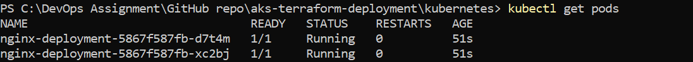
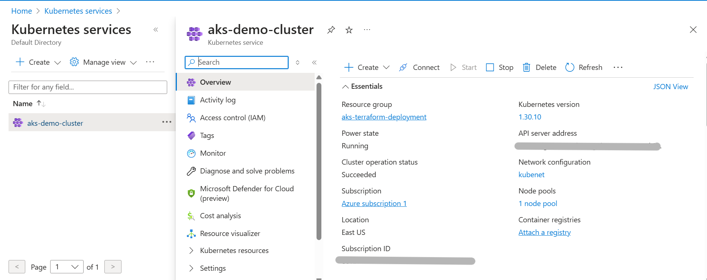

# AKS Terraform Deployment

This repository contains an Infrastructure as Code (IaC) implementation for deploying a simple application to Azure Kubernetes Service (AKS).

## Prerequisites

- Azure CLI installed and configured
- Terraform installed
- kubectl installed
- Git installed
- Azure subscription

## Repository Structure

```
aks-terraform-deployment/
├── kubernetes/             # Kubernetes manifest files
│   ├── deployment.yaml     # Defines nginx deployment with 2 replicas
│   └── service.yaml        # Defines LoadBalancer service
├── terraform/              # Terraform configuration files
│   ├── main.tf             # Main AKS cluster configuration
│   ├── variables.tf        # Variable definitions
│   └── outputs.tf          # Output definitions
├── screenshots/            # Documentation screenshots
│   ├── terraform-apply.png
│   ├── kubectl-get-nodes.png
│   ├── kubectl-get-pods.png
│   ├── kubectl-get-services.png
│   ├── nginx-welcome-page.png
│   └── azure-portal-aks.png
└── README.md               # This documentation file
```

## Setup Process

### 1. Setting Up the AKS Cluster

I used Terraform to provision an AKS cluster in Azure with the following steps:

```bash
# Clone the repository
git clone https://github.com/your-username/aks-terraform-deployment.git
cd aks-terraform-deployment

# Initialize Terraform
cd terraform
terraform init

# Preview the changes Terraform will make
terraform plan
```

```bash
# Apply the Terraform configuration to create resources
terraform apply
```


<!-- Screenshot of terminal showing successful terraform apply completion -->

After confirming the plan, Terraform created:

- A resource group
- An AKS cluster with 1 node (Standard_B2s size for cost efficiency)
- A kubeconfig file for connecting to the cluster

### 2. Connecting to the Cluster

Once the cluster was created, I connected kubectl to it:

```bash
# Extract the kubeconfig from Terraform output and save it to a file
terraform output -raw kube_config > kubeconfig
# This command extracts the Kubernetes configuration (kubeconfig) from Terraform outputs and saves it to a file named "kubeconfig".
# This file contains the necessary credentials and connection information to communicate with your AKS cluster.

# Set the KUBECONFIG environment variable
$env:KUBECONFIG = "$(Get-Location)\kubeconfig"
# This sets the KUBECONFIG environment variable to point to your newly created kubeconfig file.
# This tells kubectl which cluster to connect to.
```

```bash
# Verify connection to the cluster
kubectl get nodes
```


<!-- Screenshot of terminal showing successful connection to cluster nodes -->

### 3. Deploying the Application

I deployed a simple nginx application with 2 replicas:

```bash
# Navigate to the kubernetes directory
cd ..\kubernetes

# Apply the deployment
kubectl apply -f deployment.yaml

# Apply the service
kubectl apply -f service.yaml

# Verify the pods are running
kubectl get pods
```



<!-- Screenshot of terminal showing 2 nginx pods running -->

```bash
# Verify the service has an external IP
kubectl get services
```


<!-- Screenshot of terminal showing the service with an assigned external IP -->

### 4. Checking the Deployment

To verify the application was working correctly:

```bash
# Get the external IP of the service
kubectl get service nginx-service
```


<!-- Screenshot showing the detailed output of the nginx service with external IP -->

The output shows the external IP address assigned to the service, which I used to access the application.

I then accessed the application in a web browser by navigating to the EXTERNAL-IP address (http://20.121.235.12 in this example) and confirmed the nginx welcome page was displayed.


<!-- Screenshot of browser showing the nginx welcome page -->

Alternatively, I tested it with curl:

```bash
curl http://20.121.235.12
```


<!-- Screenshot of terminal showing HTML response from curl -->

## Challenges and Solutions

### Issue: Kubeconfig File Format Error

**Problem:** When running kubectl commands, I encountered an error with the kubeconfig file:

```
error: error loading config file: yaml: line 2: mapping values are not allowed in this context
```

**Solution:** I regenerated the kubeconfig file using the raw output from Terraform:

```bash
terraform output -raw kube_config > kubeconfig
```

This ensured the file was properly formatted without any extra characters that might break the YAML syntax.

### Issue: External IP Taking Time to Provision

**Problem:** After deploying the service, the EXTERNAL-IP remained in "pending" state for a few minutes.

**Solution:** This is normal Azure behavior when provisioning a load balancer. I waited approximately 5 minutes for the IP to be assigned, periodically checking with:

```bash
kubectl get services
```

## Cleanup

To avoid unnecessary Azure charges, I removed all resources after completing the assignment:

```bash
# Navigate to the terraform directory
cd ../terraform

# Destroy all resources
terraform destroy
```

For additional confirmation, I've also included a screenshot of the Azure Portal showing the running AKS cluster:



<!-- Screenshot of Azure Portal showing the AKS cluster overview page -->
